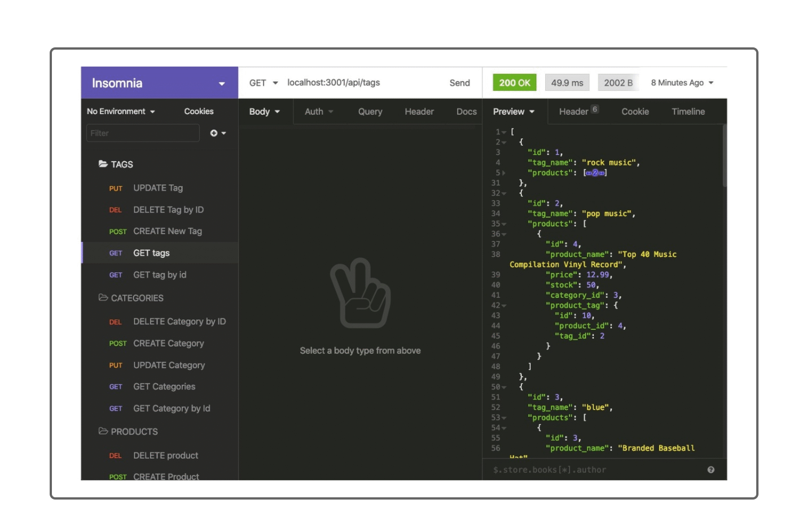

# orm-project

## Description

A backend e-commerce application that uses the ORM sequelize to perform various CRUD operations on data in a MYSQL database.

## Table of Contents

* [Installation](#installation)
* [Usage](#usage)
* [Credits](#credits)
* [License](#license)

## Installation
* Download source files

## Usage 
* Run npm install to install the dependencies
* Open up mySQL2 and run the db/schema.sql file to create database
* Run npm run seed to add data to the database
* run npm start to start the application

## Contributing

All the code for this project was written by Jaydon Goodrich

## License

Code released under the [Unlicense](http://unlicense.org/)

****

## Questions
For further questions I can be reached at:

GitHub: [Jaydon-Goodrich](https://github.com/Jaydon-Goodrich)

Email: JaydonGoodrich@gmail.com

Further Instructions: 

You can also reach out on the following social media platforms:

Instagram: Jaydon-Goodrich

Facebook: Jaydon-Goodrich

LinkedIn: Jaydon-Goodrich
    
## Reference
[Link to Youtube showing this project](https://youtu.be/kJdbP9EEwHI)

